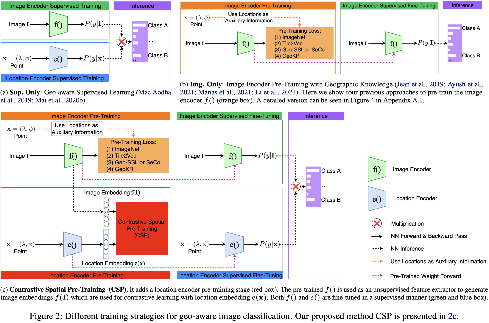
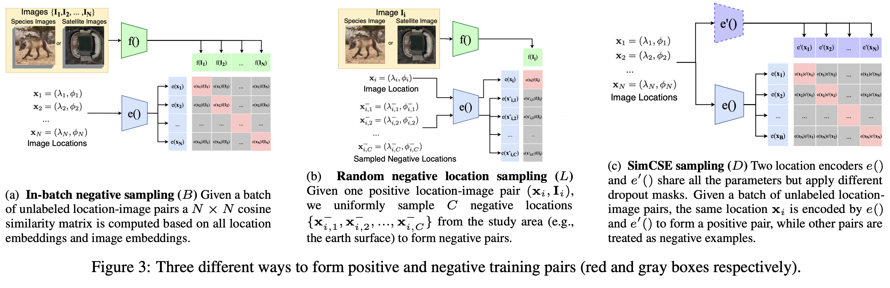

# CSP: Self-Supervised Contrastive Spatial Pre-Training for Geospatial-Visual Representations
Code for recreating the results in [our ICML 2023 paper](https://gengchenmai.github.io/csp-website/).

## Related Link
1. [Paper](https://gengchenmai.github.io/papers/2023-ICML-CSP.pdf)
2. [OpenReview Paper](https://openreview.net/forum?id=R3WrLjtzG8)
3. [Arxiv Paper](http://arxiv.org/abs/2305.01118)
4. [ResearchGate paper](https://www.researchgate.net/publication/370441087_CSP_Self-Supervised_Contrastive_Spatial_Pre-Training_for_Geospatial-Visual_Representations)
5. [CSP Website](https://gengchenmai.github.io/csp-website/)


Please visit [CSP Website](https://gengchenmai.github.io/csp-website/) for more information.

## Our Model Overview
<p align="center">
  
</p>

## Three Constrastive Spatial Pre-Training Objectives
<p align="center">
  
</p>


### Dependencies
- Python 3.7+
- Torch 1.7.1+
- Other required packages are summarized in `main/requirements.txt`.

### Train and Evaluation
The main code are located in `main` folder

1) `run-fmow-contsoftmax.sh` do CSP-MC-BLD self-supervised pre-training and supervised trains our location encoder on fMoW datasets.  
2) `run-inat_2018-contsoftmax.sh` do CSP-MC-BLD self-supervised pre-training and supervised trains our location encoder on iNat018 datasets.

### Data
1) Download the required datasets and metadata from our project [website](https://gengchenmai.github.io/csp-website/) and put them in the `../geo_prior_data_csp/` directory. This contains features and predictions extracted from trained image classifiers along with the location metadata.
2) Update the paths in `paths.py` so they point to the correct locations on your system.  
3) Make sure you have the package versions specified in `requirements.txt`. Model training and evaluation was performed with Python 3.7.   


### Pre-trained Model

1) Pre-trained models are available to download from [here](https://gengchenmai.github.io/csp-website/).
2) `model_dir/model_inat_2018/` contains:
  - `model_inat_2018_gridcell_0.0010_32_0.1000000_1_512_leakyrelu_UNSUPER-contsoftmax_0.000500_1.000_1_1.000_TMP20.0000_1.0000_1.0000.pth.tar` is the pre-trained grid location encoder on all unlabeled iNat2018 training dataset.
  - `model_inat_2018_gridcell_0.0010_32_0.1000000_1_512_leakyrelu_contsoftmax_ratio0.050_0.000500_1.000_1_1.000_TMP20.0000_1.0000_1.0000.pth.tar` is the fine-tuned grid location encoder on 5% iNat2018 training dataset.

3) `model_dir/model_fmow/` contains:
  - `model_fmow_gridcell_0.0010_32_0.1000000_1_512_gelu_UNSUPER-contsoftmax_0.000050_1.000_1_0.100_TMP1.0000_1.0000_1.0000.pth.tar` is the pre-trained grid location encoder on all unlabeled fMoW training dataset.
  - `model_fmow_gridcell_0.0010_32_0.1000000_1_512_gelu_contsoftmax_ratio0.050_0.000050_1.000_1_0.100_TMP1.0000_1.0000_1.0000.pth.tar` is the fine-tuned grid location encoder on 5% fMoW training dataset.


### Reference
If you find our work useful in your research please consider citing [our ICML 2023 paper](https://gengchenmai.github.io/csp-website/).  
```
@inproceedings{mai2023csp,
  title={CSP: Self-Supervised Contrastive Spatial Pre-Training for Geospatial-Visual Representations},
  author={Mai, Gengchen and Lao, Ni and He, Yutong and Song, Jiaming and Ermon, Stefano},
  booktitle={International Conference on Machine Learning},
  year={2023},
  organization={PMLR}
}
```
If you use grid location encoder, please also cite [our ICLR 2020 paper](https://openreview.net/forum?id=rJljdh4KDH) and [our IJGIS 2022 paper](https://www.tandfonline.com/doi/full/10.1080/13658816.2021.2004602):
```
@inproceedings{mai2020space2vec,
  title={Multi-Scale Representation Learning for Spatial Feature Distributions using Grid Cells},
  author={Mai, Gengchen and Janowicz, Krzysztof and Yan, Bo and Zhu, Rui and Cai, Ling and Lao, Ni},
  booktitle={International Conference on Learning Representations},
  year={2020},
  organization={openreview}
}

@article{mai2022review,
  title={A review of location encoding for GeoAI: methods and applications},
  author={Mai, Gengchen and Janowicz, Krzysztof and Hu, Yingjie and Gao, Song and Yan, Bo and Zhu, Rui and Cai, Ling and Lao, Ni},
  journal={International Journal of Geographical Information Science},
  volume={36},
  number={4},
  pages={639--673},
  year={2022},
  publisher={Taylor \& Francis}
}
```